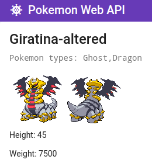

# Pokemon Web API

  It is a pet-project that was made in order to get skills in developing REST APIs using ASP.NET Core.              
[Poke API](https://pokeapi.co) was used for requesting pokemons. It is open & free with hundreds of useful requests.                     
Except this some things were practiced too: EF Core & ASP.NET Core Identity for storing and managing users; Serilog;               
Authentication using JWT; Swagger for documenting API; Deploying on Azure - currently doesn't work, trial is ended ;(                  
  
  Previously server was working without standalone, I mean without frontend and was succesfully tested by Postman.       
Later, i decided to study Angular, after few courses and reading Angular docs, I started developing frontend for my Pokemon Web API.

## Screenshots of working app
Angular server is running at https://localhost:4200, ASP.NET Core at https://localhost:5001 

This is main page, full list of pokemons is requested and got from [Poke API](https://pokeapi.co). It is scrollable.                              
For boosting proccess of writting frontend I was using [Angular Material UI](https://material.angular.io/) component library.

If we click on square started from picture till the end of page - we'll get pokemon-page. As we can see below, there are pokemon name, types, two sprites, 
height & weight.

Two more examples:                                                            

For registration we should click "Sign Up", that is located in the navbar and we'll navigated to registration-page

There are validators for every field(form-control) of form. Below we can see different validation message of different field validators.

