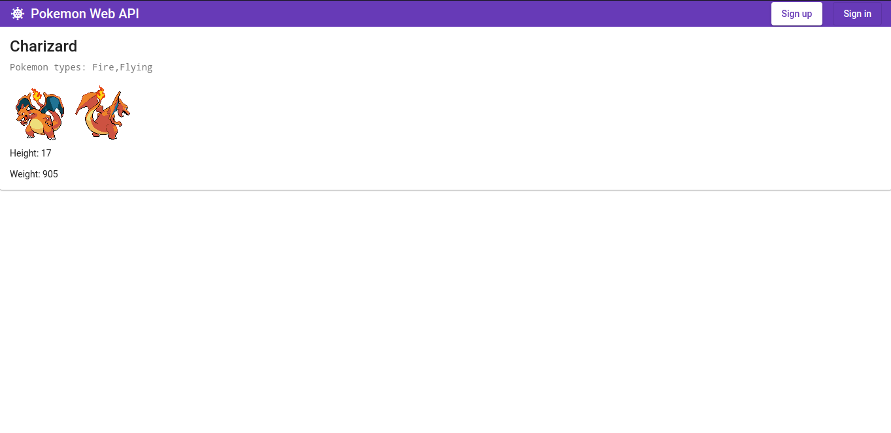

# Pokemon Web API

  It is a pet-project that was made to get skills in developing REST APIs using ASP.NET Core.              
[Poke API](https://pokeapi.co) was used for requesting pokemons. It is open & free with hundreds of useful requests.                     
Except this some things were practiced too: EF Core & ASP.NET Core Identity for storing and managing users; Serilog;               
Authentication using JWT; Swagger for documenting API; Deploying on Azure - currently doesn't work, trial is ended ;(                  
  
  Previously server was working standalone, I mean without frontend and was succesfully tested by Postman.       
Later, i decided to study Angular, after few courses and reading Angular docs, I started developing frontend for my Pokemon Web API.

## Screenshots of working app
Angular server is running at https://localhost:4200, ASP.NET Core at https://localhost:5001 

This is main page, full list of pokemons is requested and got from [Poke API](https://pokeapi.co). It is scrollable.                              
For boosting proccess of writting frontend I was using [Angular Material UI](https://material.angular.io/) component library.

If user click on square started from picture till the end of page - he'll get pokemon-page. As we can see below, there are pokemon name, types, two sprites, 
height & weight.

Two more examples:                                                            

For registration user should click "Sign Up", that is located in the navbar and he'll navigated to registration-page.

There are validators for every field(form-control) of form.                                                                                       
Below we can see different validation message of different field validators.                                                               

When every field is correct button "Sign up" will be enaibled and user can click it.

If username or email is already existed in system, user will get error message:

If everything is correct after clicking "Sign up", user will get message and will be redirected in 5 seconds to login-page.

Authorization of users is implemented with JWT Bearer.Frontend client takes token from server with exp.date and validate it for every request to the server. 
Token is stored in client's localstorage.                                                                  
If user trying to login before confirmation of email - he'll get error.

So, user should check email and click link for email confirmation.

In PostgreSQL DB we can see row "EmailConfirmed" with false value, that means user's email isn't confirmed.

After click link in email message, it'll be true and login will be successful.

After signing in user will be navigated to dashboard-page.It shows pokemons that stored in DB.                                   
User can create, edit and delete them.

Token expiration date - 30 mins, and when it is over user'll be redirected to login-page and will get the message.

So, at dasboard-page user can click "Create" and he'll be redirected to create-pokemon-page.All fields have own validators,                                       Angular checking validity of everyone.Submiting button will be disabled until all fields will be valid.                                               
There is one more button - "Type".When user clicking it new fielnd is created => FormControl is pushed into FormArray.                                                                                 

Form without errors and enabled "Create" button.                                                              
                                                       

After creating some pokemons we can try to use filtering by types and searching by name.

If user click "Open" button, he'll navigated to edit-pokemon-page.

For demonstration I've added new type "Thermal" to Raichu

Also, there is Reset Password Feature.The mechanism such as with registration.                                                                                
User must input valid email into login-page and click "Forgot Password?", if email does't exist in DB user will get error message.

If all is OK, user will get message.

Then user should check email, click link and he'll be navigated to reset-password-page.

Thare are two parametrs in query string - UserId and Code. First param for searching user in DB, second for server validation JWT.               

After clicking button user will be redirected to login-page
There are no errors after request, so user's password is changed.                                                                                           

Thats all!

